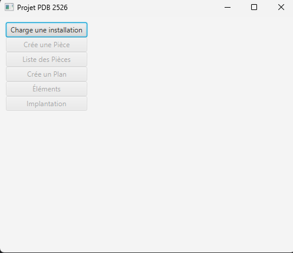
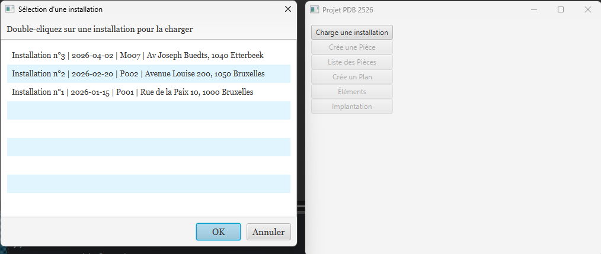
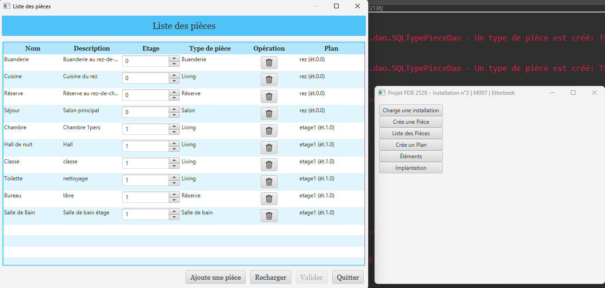
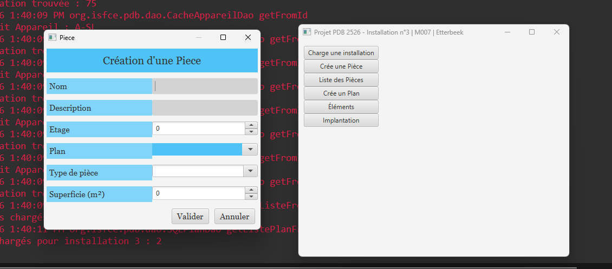
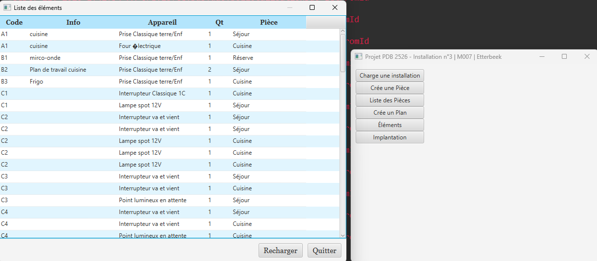
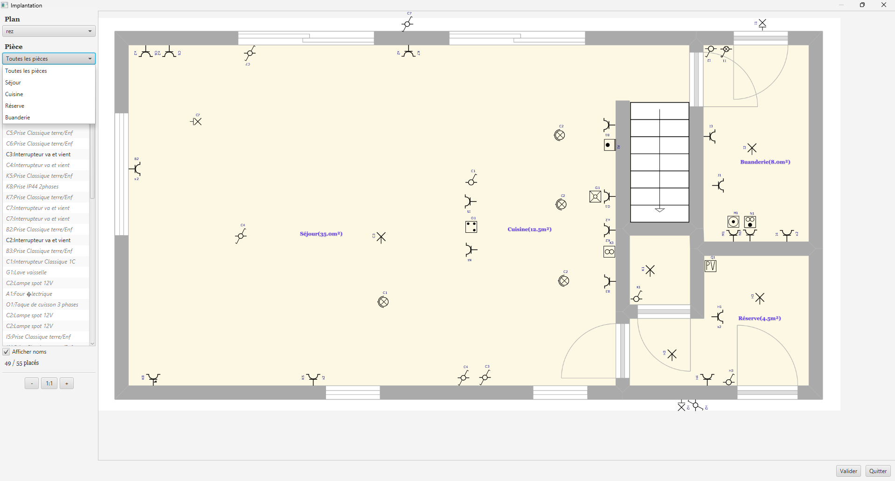
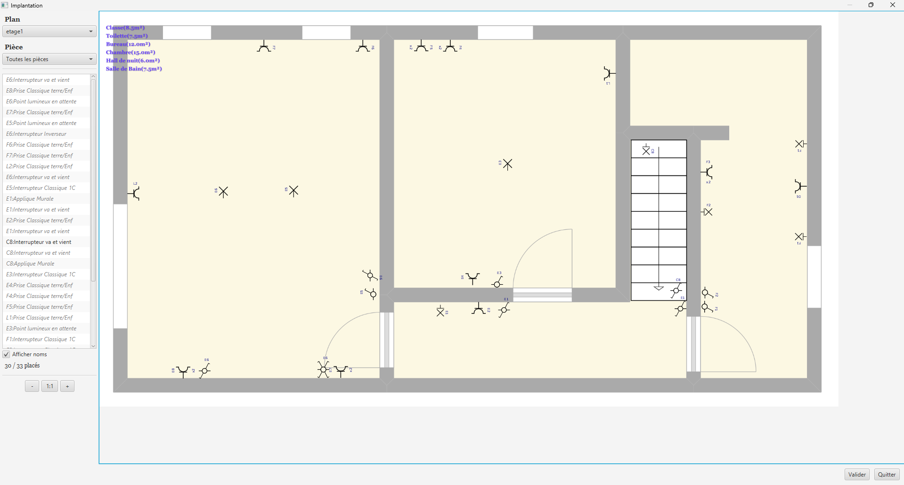
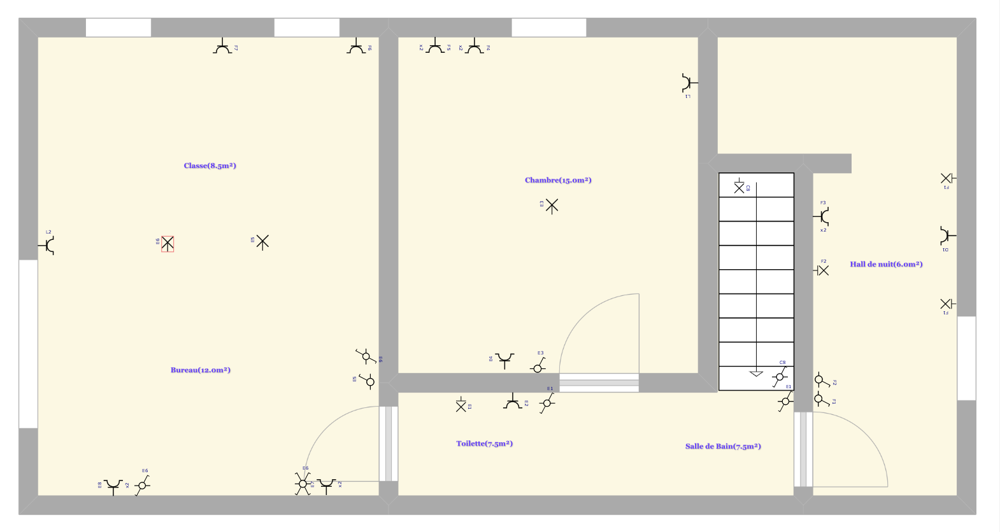
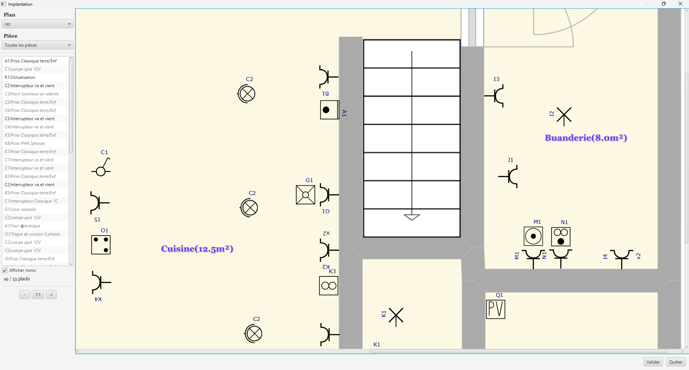

# PDB2526 — Plan d'implantation d'une installation électrique

Application de bureau JavaFX pour la gestion et le positionnement visuel d'appareils électriques sur des plans d'implantation. Développé dans le cadre du cours Projet de développement SGBD à l'ISFCE Bruxelles (2025-2026).

---

## Aperçu

L'application permet de gérer une installation électrique complète :
- Créer et organiser les **pièces** d'un bâtiment par étage
- Importer des **plans** d'étage (images PNG)
- **Assigner** les appareils électriques aux pièces
- **Positionner visuellement** chaque appareil par drag-and-drop sur le plan
- **Zoomer**, **pivoter** et **sauvegarder** les positions

<!-- 
INSTRUCTIONS : Remplace les placeholders ci-dessous par tes screenshots.
1. Crée un dossier "screenshots/" à la racine du projet
2. Mets tes captures d'écran dedans
3. Remplace les noms de fichiers ci-dessous
-->

### Captures d'écran

| Menu principal | Sélection installation |
|:-:|:-:|
|  |  |

| Liste des pièces | Création d'une pièce |
|:-:|:-:|
|  |  |

| Liste des éléments | Implantation rez-de-chaussée |
|:-:|:-:|
|  |  |

| Implantation étage V1 | Implantation étage V2 | Zoom |
|:-:|:-:|:-:|
|  |  |  |

---

## Stack technique

| Technologie | Usage |
|---|---|
| Java 17 | Langage principal (records, modules JPMS) |
| JavaFX 25 | Interface graphique (FXML, CSS, Canvas, SVG) |
| Firebird 5 | Base de données relationnelle (JDBC / Jaybird) |
| Lombok | Réduction du boilerplate (@Getter, @Builder, @Slf4j) |
| JUnit 5 | Tests unitaires |
| SLF4J | Logging structuré |
| Git / GitLab | Versioning |

---

## Architecture

```
┌──────────────────────────────────────────────┐
│              VUES (JavaFX / FXML)            │
│  VuePiece · VueListePieces · VuePlan         │
│  VueListeElements · VueImplantation          │
├──────────────────────────────────────────────┤
│              FACADE (Services)               │
│  Point d'entrée unique · Publication         │
│  Cache éléments · Orchestration DAO          │
├──────────────────────────────────────────────┤
│              DAO (Data Access)               │
│  Interface → Implémentation SQL              │
│  Cache Decorator (Svg, Appareil)             │
├──────────────────────────────────────────────┤
│           DAOFactory (Abstract Factory)      │
│  FBDAOFactory (Firebird)                     │
├──────────────────────────────────────────────┤
│            BASE DE DONNÉES (Firebird)        │
│  8 tables · FK · Transactions                │
└──────────────────────────────────────────────┘
```

### Design Patterns

| Pattern | Implémentation | Pourquoi |
|---|---|---|
| **Abstract Factory** | `DAOFactory` / `FBDAOFactory` | Changer de SGBD sans modifier le code métier |
| **Decorator** | `CacheSvgDao` wrappe `SQLSvgDao` | Ajouter du cache sans modifier le DAO |
| **Facade** | `Facade.java` | Point d'entrée unique, les vues ne connaissent pas les DAO |
| **Observer** | `PropertyChangeSupport` | Rafraîchissement automatique des vues |
| **DAO** | Interface + SQL par entité | Séparation accès données / logique métier |
| **MVC** | Modèle / FXML+CSS / Controller | Séparation des responsabilités |

---

## Base de données

```
TINSTALLATION ──> TPLAN ──> TPIECE ──> TLOCALISATION ──> TELEMENT
                                │                            │
                          TTYPE_PIECE                    TAPPAREIL ──> TSVG
```

### Tables principales

| Table | Description | Clé primaire |
|---|---|---|
| `TINSTALLATION` | Bâtiment (adresse, propriétaire, date) | `NUM_INS` (auto) |
| `TPLAN` | Étage avec image PNG | `ID_PLA` (auto) |
| `TPIECE` | Pièce (nom, étage, type, superficie) | `NUM_PIE` (auto) |
| `TELEMENT` | Appareil à placer (code, quantité) | `ID_ELE` (auto) |
| `TLOCALISATION` | Position sur le plan (x, y, angle, placé) | `FKELEMENT_LOC` |
| `TAPPAREIL` | Type d'appareil (prise, interrupteur) | `CODE_APP` |
| `TSVG` | Dessin vectoriel SVG | `CODE_SVG` |
| `TTYPE_PIECE` | Type de pièce (salon, cuisine) | `CODE_TYP` |

---

## Fonctionnalités

### Gestion des installations
- Sélection via liste interactive avec double-clic
- Affichage date, propriétaire, adresse
- Titre de fenêtre dynamique

### Gestion des pièces
- Création avec formulaire complet (nom, description, étage, type, plan, superficie)
- Liste éditable en TableView (plan modifiable par ligne via ComboBox)
- Suppression avec confirmation et cascade automatique des localisations
- Publication : ajout/suppression rafraîchit automatiquement toutes les vues ouvertes

### Gestion des plans
- Import via FileChooser avec copie automatique dans le répertoire de l'installation
- Sélection de l'étage
- Stockage nom et fichier séparément

### Association éléments ↔ pièces
- TableView avec colonne pièce éditable (ComboBoxTableCell par ligne)
- Sauvegarde immédiate au changement
- 89 éléments gérés (prises, interrupteurs, lampes, etc.)

### Vue d'implantation graphique
- **Drag-and-drop** des éléments depuis la liste vers le plan
- **Rotation** 90° (touche R)
- **Suppression** du plan (touche DELETE)
- **Zoom** CTRL+molette + boutons +/-/1:1
- **Défilement** clic droit
- **Noms des pièces** sur le plan, repositionnables par drag-and-drop
- **Filtre par pièce** via ComboBox
- **Quantité** x2/x3 affichée pour les prises multiples
- **Compteur** éléments placés / total
- **Sauvegarde optimisée** : seuls les éléments modifiés sont mis à jour
- **Raccourci CTRL+S** pour sauvegarder

### Qualité logicielle
- Tests unitaires JUnit 5 (5 tests)
- Logging structuré SLF4J
- CSS personnalisé (alternance couleurs, hover, palette cohérente)
- Validation formulaires (pseudo-classes CSS)
- Tooltips sur les boutons

---

## Défis techniques résolus

### Curseur imbriqué Firebird
Firebird ne supporte qu'un seul curseur actif par connexion. Solution : pattern "deux passes" avec `record` Java 16 — lecture des scalaires d'abord, résolution des objets liés ensuite. Appliqué dans 3 DAO.

```java
// Passe 1 : scalaires uniquement
record RawElement(int id, String codeApp, int qt, String code, String info, int ordre) {}
List<RawElement> raws = new ArrayList<>();
while (rs.next()) {
    raws.add(new RawElement(rs.getInt("ID_ELE"), rs.getString("FKAPPAREIL_ELE").trim(), ...));
}
// ResultSet fermé

// Passe 2 : résolution objets liés
for (RawElement r : raws) {
    Appareil app = factory.getAppareilDAO().getFromId(r.codeApp()).orElse(null);
    // ... construire l'objet Element
}
```

### Padding CHAR Firebird
Les colonnes CHAR sont stockées avec des espaces. Solution : `WHERE TRIM(CODE_APP) = ?` côté SQL et `.trim()` côté Java.

### Zoom et drag-and-drop
Division des coordonnées par le facteur de zoom dans les handlers mouse pour maintenir la précision du positionnement.

### Modules Java (JPMS)
Configuration `opens` et `exports` dans `module-info.java` pour permettre à JavaFX d'accéder aux contrôleurs par réflexion.

---

## Prérequis

- Java JDK 17+
- JavaFX SDK 25+
- Firebird 5
- Eclipse IDE (avec plugin EFXclipse)

## Installation

1. Cloner le dépôt :
```bash
git clone https://github.com/mana-rj11/pdb2526.git
```

2. Configurer la base de données :
   - Installer Firebird 5
   - Placer `PDB2526.FDB` dans le répertoire choisi (ex: `C:\PDB2526\`)
   - Créer `connexionPDB2526.properties` dans le dossier `ressources/` :
```properties
file : C:\\...\\PDB2526.FDB
autoCommit : false
user : SYSDBA
password : masterkey
encoding : UTF8
```

3. Configurer les images des plans :
   - Créer `installation.properties` dans `ressources/` :
```properties
imagesPath=C:/PDB2526/images/
```
   - Placer les images PNG dans `{imagesPath}{installationId}/`

4. Ouvrir dans Eclipse, configurer le Build Path (JavaFX SDK, Jaybird, Lombok, JUnit 5)

5. Lancer `MainController.java`

---

## Structure du projet

```
pdb2526/
├── src/
│   └── org/isfce/pdb/
│       ├── controller/          # MainController
│       ├── dao/                 # DAO interfaces + implémentations SQL
│       ├── databases/           # Connexion, Factory
│       ├── exceptions/          # InstallationException
│       ├── model/               # Classes métier (Element, Piece, Plan, ...)
│       ├── services/            # Facade
│       └── view/
│           ├── bundle/          # I18N, propriétés
│           ├── css/             # Feuille de style
│           ├── element/         # Vue liste éléments
│           ├── icon/            # Icônes (trash, ...)
│           ├── piece/           # Vue pièce + liste pièces
│           └── plan/            # Vue plan + implantation
├── tests/
│   └── org/isfce/pdb/dao/      # Tests JUnit
├── ressources/                  # Scripts SQL, propriétés
└── module-info.java
```

---

## Auteur

**Nilton Mana** — Étudiant en Bachelor Développement d'Applications à l'ISFCE Bruxelles

---

## Licence

Projet académique — ISFCE Bruxelles — Cours SGBD 2025-2026
